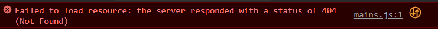

# Where's Waldo
## DOM Challenge
### Broken Application
---
## Concept:
**When** a user clicks on a button, indicated by a number on the grid, it will disable the button and show a new image as its background.

**If** the image is Waldo, it will disable all other buttons and will prompt the user if they would like to restart the search.

**If** 19 of the 20 images are selected, the last image will automatically provide Waldo.

    Note: Waldo's image is 1.jpg within the assets folder.

Here is a quick example of a working version:

[Waldo Sample](https://media.giphy.com/media/v1.Y2lkPTc5MGI3NjExdmh3aTAxMXIwYzd1NDd5M3FwZzZua3ExZWlzMXE1dnF6NnF0bTltaCZlcD12MV9pbnRlcm5hbF9naWZfYnlfaWQmY3Q9Zw/3L2mwTwchuf7FsAYuG/giphy.gif)

---
# Getting Started:
- You will need to **Fork** this to your own repository.
- You will then need to **Clone** the project to your workstation.

*Suggestion: store this within a LABS or PROJECT folder.* 

If you need a reminder how to do this, please watch this [loom](https://www.loom.com/share/5c1c334b846a4887b87184068a126857?sid=f4eae62d-c63f-4bac-aa0b-8e54cc222f79).

# Tasks:
1. There are several points where this application is broken. 
2. It has been reviewed and it seems that there are no issues within `style.css` nor any of the files within the `assets folder`.
3. What should be considered is the HTML document and the `main.js` file associated.
4. All of the logic seems to flow correct so all these `bugs` must be syntax issues.

## Consider:
- **Console Log** the code if you're trying to find how the code is being tracked by your program.
- **Error messages** within the console. 
  - Our console is very helpful in detailing the message. If the message is a bit confusing, consider that it also notes the file, line, and column that the code is breaking.

- ex: We see that there is an issue loading the `main.js` file. It's not found at all. If it isn't loading, perhaps we should see where we are attempting to load it and see if we can locate the issue.

## End Game
- There are a total of 14 errors within this application.
- Good Luck!
